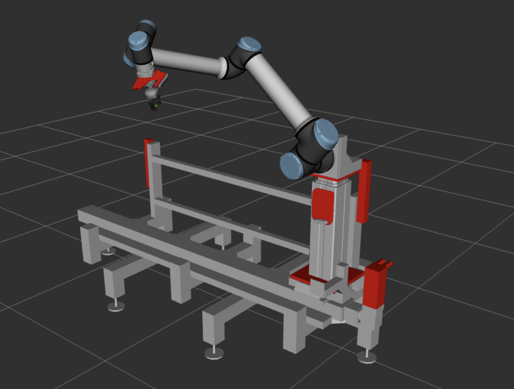

# ChonkUR L Rail-E

Descriptions, deployments, tooling, and MoveIt configuration for the ChonkUR L Rail-E robot system,
part of the [iMETRO Facility](https://ntrs.nasa.gov/citations/20240013956) at NASA's Johnson Space Center.
This project is intended for use in one of ER4's managed workspaces (such as the in the [clr_ws](https://github.com/NASA-JSC-Robotics/clr_ws)).

The hardware includes the [ChonkUR robot](chonkur/README.md) mounted on an Ewellix Lift and Vention Linear Rail system.



## Usage

The project includes a kinematic simulation for the robot.
Launching the controllers and hardware interface is done using the provided launch files.

To launch the kinematic simulation:

```bash
ros2 launch clr_deploy clr_sim.launch.py

# Or to include the environment mockups
ros2 launch clr_deploy clr_sim.launch.py model_env:=true
```

For hardware we run the UR pendantless, which is a two part launch process:

```bash
# To launch the hardware robot, first deploy chonkur communications to activate the dashboard client
# in its own long-lived shell on the controls machine.
ros2 launch chonkur_deploy chonkur_comm.launch.py

# On the console machine, launch the UR GUI, which handles most operations that normally occur on the UR pendant
ros2 launch chonkur_deploy chonkur_gui.launch.py

# Back on the controls machine, after reading the UR arm
# Start the hardware interfaces for the rail, lift, and ChonkUR
ros2 launch clr_deploy clr_hw.launch.py
```

A MoveIt RViz widget can then be launched with:

```bash
ros2 launch clr_moveit_config clr_moveit.launch.py

# Or to include the environment mockups
ros2 launch clr_moveit_config clr_moveit.launch.py model_env:=true
```

A MuJoCo simulation including the environment is available in [clr_mujoco_config](./clr_mujoco_config/README.md).
Note that it requires the [MuJoCo ROS 2 simulation hardware interface](https://github.com/ros-controls/mujoco_ros2_control) to run.

```bash
# Start the mujoco ros2 control-based simulation
ros2 launch clr_mujoco_config clr_mujoco.launch.py

# In another shell launch the moveit interface with sim parameters set
ros2 launch clr_moveit_config clr_moveit.launch.py include_mockups_in_description:=true use_sim_time:=true
```

While position control is enabled by default, torque control can also be used with the UR10e in the MuJoCo simulation and on hardware. First, enable the effort controller, then send a command:

```bash
# Deactivate the default controller and activate the effort controller
ros2 control switch_controllers --deactivate joint_trajectory_controller --activate effort_controller

# Example: set the UR's shoulder_pan_joint torque to 1.0
ros2 topic pub --once /effort_controller/commands std_msgs/msg/Float64MultiArray "{data: [1.0, 0.0, 0.0, 0.0, 0.0, 0.0]}"

# Stop the previous command
ros2 topic pub --once /effort_controller/commands std_msgs/msg/Float64MultiArray "{data: [0.0, 0.0, 0.0, 0.0, 0.0, 0.0]}"
```

## Citation

This project falls under the purview of the iMETRO project.
If you use this in your own work, please cite the following paper:

```bibtex
@INPROCEEDINGS{imetro-facility-2025,
  author={Dunkelberger, Nathan and Sheetz, Emily and Rainen, Connor and Graf, Jodi and Hart, Nikki and Zemler, Emma and Azimi, Shaun},
  booktitle={2025 22nd International Conference on Ubiquitous Robots (UR)},
  title={Design of the iMETRO Facility: A Platform for Intravehicular Space Robotics Research},
  year={2025},
  volume={},
  number={},
  pages={390-397},
  keywords={NASA;Moon;Seals;Maintenance engineering;Maintenance;Robots;Standards;Open source software;Testing;Logistics},
  doi={10.1109/UR65550.2025.11077983}}
```
