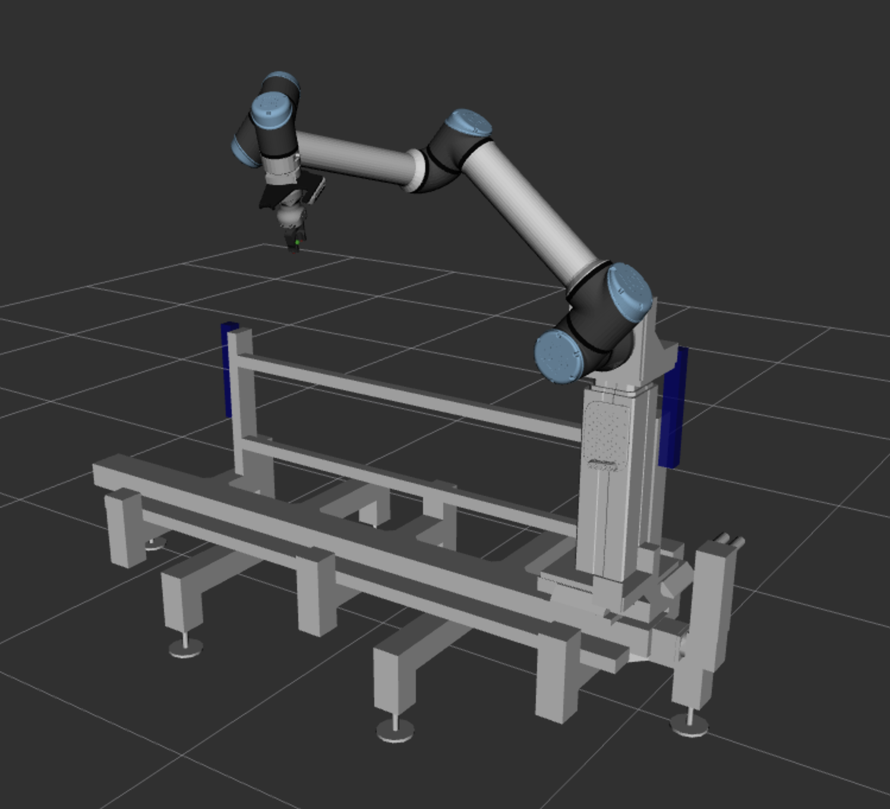

# ChonkUR L Rail-E

Descriptions, deployments, tooling, and MoveIt configuration for the ChonkUR L Rail-E robot system,
part of the [iMETRO Facility](https://ntrs.nasa.gov/citations/20240013956) at NASA's Johnson Space Center.
This project is intended for use in one of ER4's managed workspaces (such as the `clr_ws`).

The hardware includes the [ChonkUR robot](chonkur/README.md) mounted on an Ewellix Lift and Vention Linear Rail system.



## Usage

The project includes a kinematic simulation for the robot.
Launching the controllers and hardware interface is done using the provided launch files.

To launch the Kinematic simulation:

```bash
ros2 launch clr_deploy clr_sim.launch.py
```

For hardware we run the UR pendantless, which is a two part launch process:

```bash
# To launch the hardware robot, first deploy the UR tools to activate the dashboard client
# in its own long-lived shell.
ros2 launch chonkur_deploy ur_tools.launch.py

# Start the hardware interfaces for the rail, lift, and ChonkUR.
ros2 launch clr_deploy clr_hw.launch.py
```

A MoveIt RViz widget can then be launched with:

```bash
ros2 launch clr_moveit_config clr_moveit.launch.py
```
