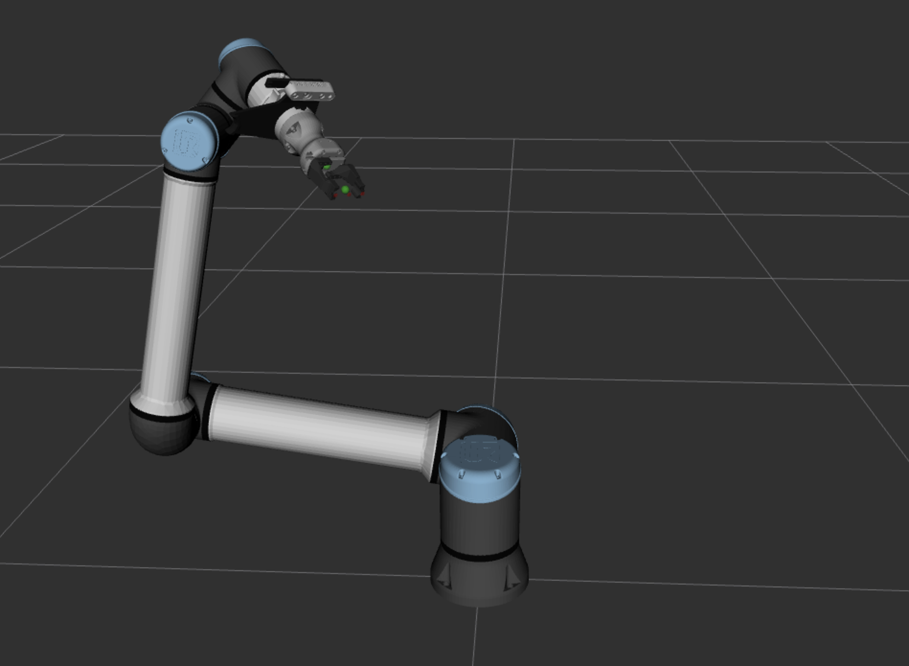

# ChonkUR

Descriptions, deployments, and MoveIt configuration for the ChonkUR robot,
part of the [iMETRO Facility](https://ntrs.nasa.gov/citations/20240013956) at NASA's Johnson Space Center.
This project is intended for use in one of ER4's managed workspaces (such as the `clr_ws`).

The robot includes:

* UR10e serial manipulator
* Robotiq Hand-E Gripper with custom printed fingers
* Wrist mounted Realsense RGB-D camera



## Usage

The project includes a kinematic simulation for the robot.
Launching the controllers and hardware interface is done using the provided launch files.

To launch the Kinematic simulation:

```bash
ros2 launch chonkur_deploy chonkur_sim.launch.py
```

For hardware we run the UR pendantless, which is a two part launch process:

```bash
# To launch the hardware robot, first deploy the UR tools to activate the dashboard client
# in its own long-lived shell.
ros2 launch chonkur_deploy ur_tools.launch.py

# Then start the hardware interface.
ros2 launch chonkur_deploy chonkur_hw.launch.py
```

A MoveIt RViz widget can then be launched with:

```bash
ros2 launch chonkur_moveit_config chonkur_moveit.launch.py
```
