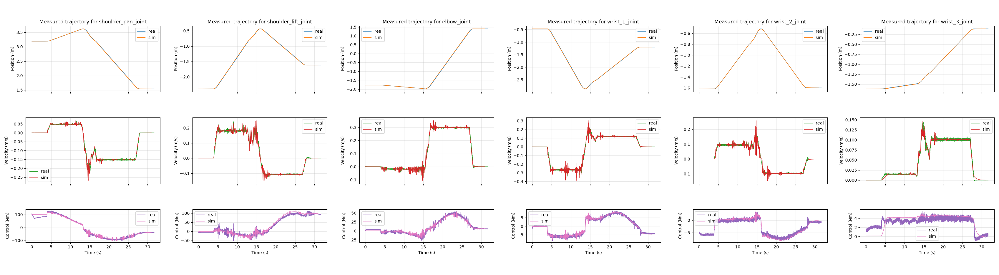

# CLR Mujoco Config

Mujoco configuration for launching CLR in a simulated Mujoco environment.

## Launching

The program must be launched from inside a supported environment.
Details are not included here, but can be found in the `mujoco_ros2_control` repo.

To start the sim,

```bash
ros2 launch clr_mujoco_config clr_mujoco.launch.py
```

## Conversion

We provide a [launch file](./launch/generate_clr_mjcf.launch.py) to run the MJCF conversion tool against the description file in [clr_mujoco_xacro.urdf](./urdf/clr_mujoco_xacro.urdf).
By default, the file will use the included [mujoco_inputs.xml](./description/mujoco_inputs.xml).

To run the converter:

```bash
ros2 launch clr_mujoco_config generate_clr_mjcf.launch.py
```

There are two ways you can run the script - `use_pregenerated_assets_dir:=false` (default) or `use_pregenerated_assets_dir:=true`.
If you want to build the mujoco description information from scratch, you can use `use_pregenerated_assets_dir:=false`, and everything will be regenerated.
However, if you are trying to just add some component to an existing infrastructure, you can use `use_pregenerated_assets_dir:=true`, and this should generate a much smaller delta between the existing code base and the new code base.
The hope is in this case, you can just copy the components that are different into the proper directories, which should be pretty minimal.

The resulting output will be written to a folder called `mjcf_data` in the current directory.
From there, the contents can be simulated with the following command, run from the same directory that you ran the converter from.

```bash
simulate mjcf_data/scene.xml
```

Any contents can be copied and updated as needed.

## Notes on the Sim-to-Real Gap
We used [MuJoCo's system identification toolbox](https://github.com/google-deepmind/mujoco/blob/main/python/mujoco/sysid/README.md) to identify joint parameters for CLR's UR10e.
We then evaluated the sim-to-real gap by running a free-space trajectory in simulation and on hardware, the results of which are shown below:



In the above experiment, the average joint torque RMSE as a percentage of each joint's maximum effort was 10.1%.
Evaluating the sim-to-real gap for our CLR simulation is an ongoing area of work, and we plan to provide data in object interaction scenarios as well as from the force-torque sensor in the near future.
